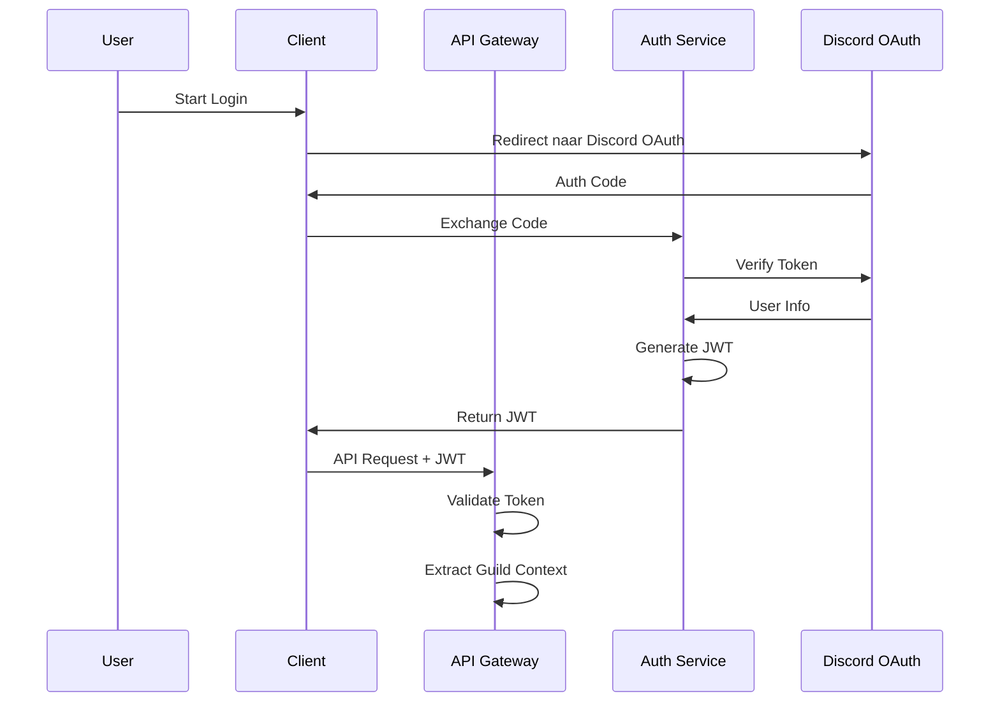

**Context:** Authentication en Autorisatie Strategie voor Multi-Guild Systeem

**Details:**
Implementatie van een JWT-based authenticatie systeem met guild-specifieke claims voor het DCM platform.

**Authenticatie Flow:**


**JWT Structure:**
```json
{
  "header": {
    "alg": "RS256",
    "typ": "JWT"
  },
  "payload": {
    "sub": "discord_user_id",
    "guilds": [
      {
        "id": "guild_id",
        "permissions": ["ADMIN", "MANAGE_TASKS"]
      }
    ],
    "iat": 1234567890,
    "exp": 1234567890
  }
}
```

**Rationale:**
1. **Schaalbaarheid:**
   - Stateless authenticatie
   - Minimale database lookups
   - Gedistribueerde validatie mogelijk

2. **Security:**
   - Guild-specifieke permissies in token
   - Korte token levensduur (1 uur)
   - Refresh token rotatie

3. **Developer Experience:**
   - Eenvoudige integratie in services
   - Duidelijke permissie structuur
   - Self-contained tokens

**Technische Implementatie:**
1. **Token Management:**
   ```typescript
   interface GuildClaim {
     id: string;
     permissions: string[];
   }

   interface TokenPayload {
     sub: string;
     guilds: GuildClaim[];
     iat: number;
     exp: number;
   }
   ```

2. **Permission Checks:**
   ```typescript
   const checkGuildPermission = (
     token: TokenPayload,
     guildId: string,
     requiredPermission: string
   ): boolean => {
     const guildClaim = token.guilds.find(g => g.id === guildId);
     return guildClaim?.permissions.includes(requiredPermission) ?? false;
   };
   ```

**Security Maatregelen:**
1. **Token Security:**
   - RS256 signing algorithm
   - Private key rotatie elke 30 dagen
   - Korte token levensduur

2. **Rate Limiting:**
   - Per user/IP combinatie
   - Progressieve rate limits
   - Guild-specifieke limieten

3. **Monitoring:**
   - Failed auth attempts logging
   - Token usage patterns
   - Permissie access patterns

**Next Steps:**
1. Implementeer token generation service
2. Setup key rotation infrastructure
3. Ontwikkel permission middleware
4. Implementeer rate limiting
5. Setup security monitoring

---