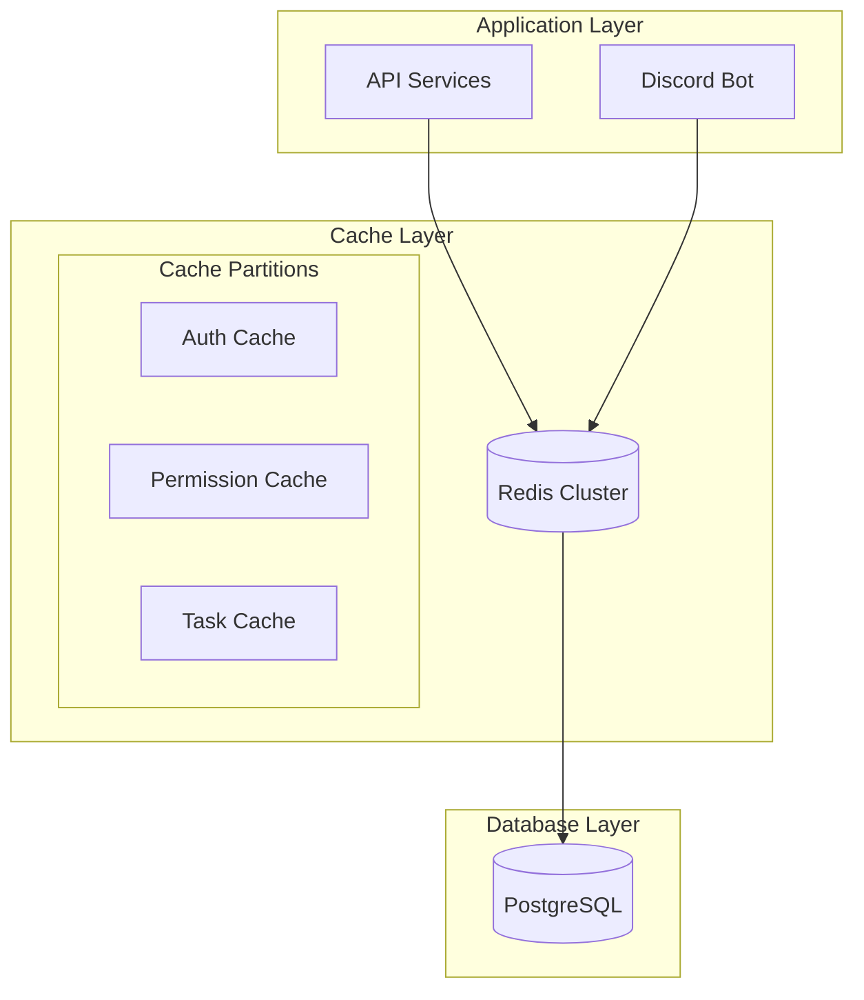

**Context:** Caching Strategie voor Multi-Guild Systeem

**Details:**
Implementatie van een gedistribueerd caching systeem met Redis voor het DCM platform, met focus op guild-isolatie en performance.

**Cache Architecture:**


**Key Design:**
1. **Key Structure:**
   ```
   guild:{guild_id}:{entity}:{id}
   guild:{guild_id}:tasks:recent
   guild:{guild_id}:permissions
   global:user:{user_id}
   ```

2. **TTL Strategie:**
   - Auth tokens: 1 uur
   - Permissies: 5 minuten
   - Task lijsten: 2 minuten
   - User data: 15 minuten

**Rationale:**
1. **Isolatie:**
   - Guild-specifieke key prefixes
   - Aparte cache partities mogelijk
   - Geen cross-guild data leakage

2. **Performance:**
   - Snelle toegang tot frequent gebruikte data
   - Verminderde database load
   - Betere response times

3. **Schaalbaarheid:**
   - Horizontaal schaalbare Redis cluster
   - Onafhankelijke guild caches
   - Flexibele partitioning

**Cache Policies:**

1. **Write Policies:**
   ```typescript
   interface CacheWritePolicy {
     writeStrategy: 'write-through' | 'write-behind';
     consistency: 'strong' | 'eventual';
     ttl: number;
   }

   const taskCachePolicy: CacheWritePolicy = {
     writeStrategy: 'write-through',
     consistency: 'strong',
     ttl: 120 // 2 minutes
   };
   ```

2. **Invalidation Strategie:**
   - Pattern-based invalidation voor gerelateerde keys
   - Cascade updates voor gerelateerde data
   - Bulk invalidation voor guild-wide changes

**Implementatie Details:**

1. **Cache Manager:**
   ```typescript
   interface CacheManager {
     get(guildId: string, key: string): Promise<any>;
     set(guildId: string, key: string, value: any, ttl?: number): Promise<void>;
     invalidate(guildId: string, pattern: string): Promise<void>;
   }
   ```

2. **Redis Cluster Setup:**
   ```yaml
   redis:
     cluster:
       nodes:
         - host: redis-1
           port: 6379
         - host: redis-2
           port: 6379
       replicas: 1
     maxRetries: 3
     connectTimeout: 10000
   ```

**Monitoring & Onderhoud:**
1. **Metrics:**
   - Hit/miss ratio per guild
   - Memory usage per guild
   - Invalidation patterns
   - Response times

2. **Maintenance:**
   - Automatische key expiration
   - Regular memory usage analysis
   - Performance tuning per guild

**Error Handling:**
1. **Fallback Strategy:**
   - Graceful degradation naar database
   - Circuit breaker pattern
   - Retry met exponential backoff

2. **Data Recovery:**
   - Backup van kritieke cache data
   - Rebuild procedures
   - Consistency checks

**Next Steps:**
1. Implementeer Redis Cluster setup
2. Ontwikkel cache manager service
3. Setup monitoring & alerts
4. Documenteer recovery procedures
5. Implementeer performance testing

---