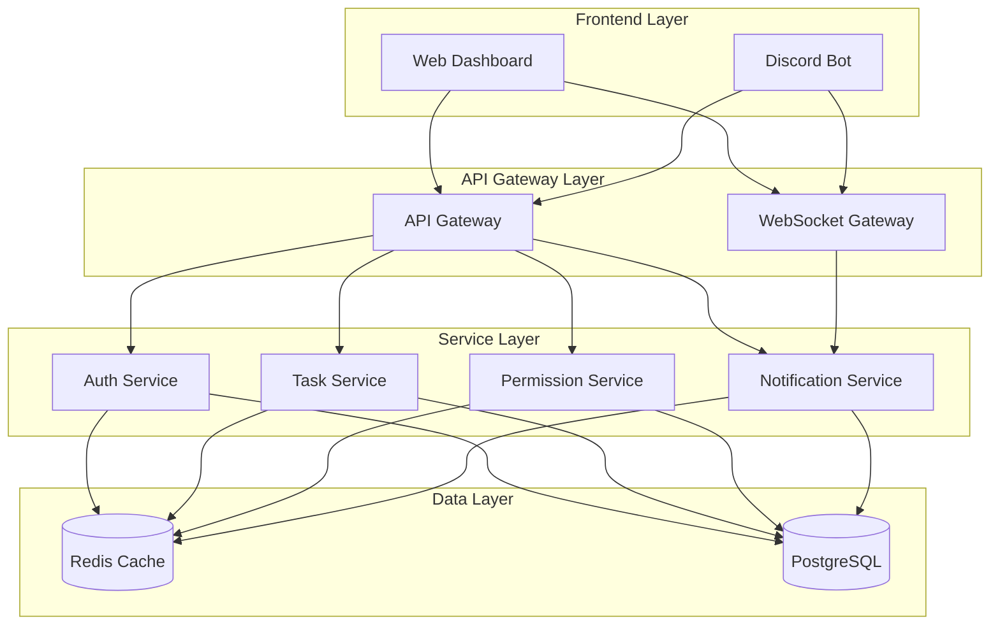
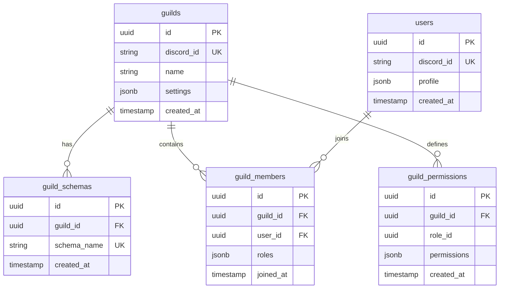

# Discord Cleaning Manager - System Architecture

## Architectuur Overview
- Project: Discord Cleaning Manager (DCM)
- Architectuur Versie: 1.0
- Laatst Bijgewerkt: 2025-04-01

### Architectuur Overview
DCM is opgezet als een gedistribueerd systeem met strikte multi-tenant isolatie op guild-niveau. De architectuur is gebaseerd op microservices principes met een focus op schaalbaarheid, beveiliging en data-isolatie.

### Component Diagram

### Key Components

#### API Gateway
- Verantwoordelijkheid: Centrale toegangspoort voor alle client requests
- Interfaces: REST API + WebSocket endpoints
- Dependencies: Auth Service, andere microservices
- Technologie: Node.js, Express

#### Discord Bot
- Verantwoordelijkheid: Discord interactie en command handling
- Interfaces: Discord.js Events + Commands
- Dependencies: API Gateway, Auth Service
- Technologie: Discord.js, Node.js

#### Auth Service
- Verantwoordelijkheid: OAuth2 flow, token validatie, permissie checks
- Interfaces: REST API voor auth operaties
- Dependencies: PostgreSQL, Redis
- Technologie: Node.js, Passport.js

#### Permission Service
- Verantwoordelijkheid: Guild-specifieke permissie management
- Interfaces: REST API voor permissie checks
- Dependencies: PostgreSQL, Redis
- Technologie: Node.js, CASL

### Database Schema

### Data Flow

1. Client Authentication Flow:
   - Client authenticates via Discord OAuth2
   - System genereert JWT met guild-specifieke claims
   - Alle requests bevatten guild_id in header/token

2. Request Flow:
   - Request komt binnen via API Gateway
   - Gateway valideert JWT en extracteert guild_id
   - Permission service controleert toegangsrechten
   - Request wordt doorgestuurd naar juiste service
   - Service gebruikt guild_id voor schema selectie
   - Response wordt gefilterd op guild-niveau

### Technical Decisions

1. Multi-Guild Database Isolatie
   - Keuze: Schema-based Isolation
   - Rationale: Betere isolatie dan row-level security, makkelijker backup/restore per guild
   - Link: [Database Isolatie Beslissing](../decision_log/2025-04-01_14-45-00_database-isolation.md)

2. Authentication Strategie
   - Keuze: JWT met guild-specific claims
   - Rationale: Schaalbaarheid, geen database lookups nodig voor basis auth
   - Link: [Auth Strategie Beslissing](../decision_log/2025-04-01_14-45-01_auth-strategy.md)

3. Caching Strategie
   - Keuze: Redis met guild-prefix keys
   - Rationale: Snelle toegang, goede isolatie, atomic operations
   - Link: [Caching Strategie Beslissing](../decision_log/2025-04-01_14-45-02_caching-strategy.md)

### Architectural Principles

1. Strikte Guild Isolatie
   - Alle data en operaties zijn guild-scoped
   - Geen cross-guild data access mogelijk
   - Audit logging op guild niveau

2. Security by Design
   - Zero-trust architecture
   - Alle requests gevalideerd op guild niveau 
   - Rate limiting per guild/user combo

3. Horizontal Scalability
   - Stateless services
   - Distributed caching
   - Message-based communicatie

4. Performance
   - Efficient schema switching
   - Query optimalisatie per guild
   - Slim cache gebruik

5. Maintainability
   - Consistent schema design
   - Gestandaardiseerde error handling
   - Uitgebreide monitoring