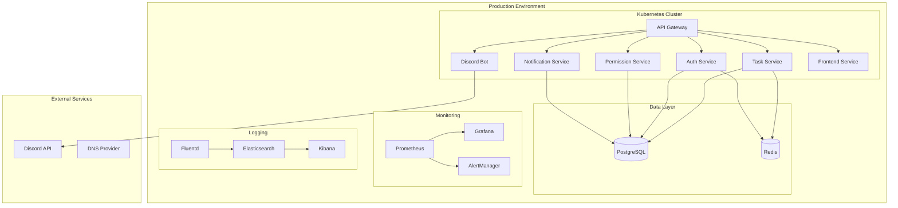
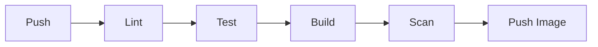

# Discord Cleaning Manager - Infrastructure Design Document

## 1. Infrastructure Overview

### 1.1 System Architecture


### 1.2 Environments
1. **Development**
   - Local development met Docker Compose
   - Minikube voor Kubernetes testing
   - Local PostgreSQL en Redis instances
   
2. **Staging**
   - Kleine Kubernetes cluster
   - Gereduceerde resources
   - Test data en configuraties
   
3. **Production**
   - Volledig geschaalde Kubernetes cluster
   - High-availability configuratie
   - Productie resources en configuraties

## 2. Infrastructure Components

### 2.1 Compute Layer (Kubernetes)

#### Cluster Configuratie
- Kubernetes v1.27+
- Node pools:
  - System (2 nodes): Voor systeem componenten
  - Application (3+ nodes): Voor applicatie workloads
  - Database (3 nodes): Voor PostgreSQL en Redis
  - Monitoring (2 nodes): Voor monitoring en logging

#### Resource Allocatie
```yaml
# Voorbeeld resource requests/limits
resources:
  requests:
    cpu: 100m
    memory: 256Mi
  limits:
    cpu: 500m
    memory: 512Mi
```

### 2.2 Data Layer

#### PostgreSQL Configuratie
- Version: 15
- High Availability met patroni
- Per-guild schema isolatie
- Backup schema:
  - Full backup: Dagelijks
  - WAL archiving: Continu
  - Retentie: 30 dagen

#### Redis Configuratie
- Version: 7.0
- Cluster mode enabled
- Persistence: RDB + AOF
- Key prefix per guild voor isolatie

### 2.3 Networking

#### Ingress Configuratie
```yaml
apiVersion: networking.k8s.io/v1
kind: Ingress
metadata:
  annotations:
    kubernetes.io/ingress.class: nginx
    cert-manager.io/cluster-issuer: letsencrypt-prod
spec:
  rules:
    - host: api.dcm.example.com
      http:
        paths:
          - path: /
            pathType: Prefix
            backend:
              service:
                name: api-gateway
                port:
                  number: 80
```

#### Network Policies
```yaml
apiVersion: networking.k8s.io/v1
kind: NetworkPolicy
metadata:
  name: default-deny
spec:
  podSelector: {}
  policyTypes:
    - Ingress
    - Egress
```

### 2.4 Monitoring & Logging

#### Prometheus Configuratie
```yaml
global:
  scrape_interval: 15s
  evaluation_interval: 15s

scrape_configs:
  - job_name: 'kubernetes-pods'
    kubernetes_sd_configs:
      - role: pod
    relabel_configs:
      - source_labels: [__meta_kubernetes_pod_annotation_prometheus_io_scrape]
        action: keep
        regex: true
```

#### Logging Pipeline
- Fluentd op elke node
- Elasticsearch indices per guild
- Kibana dashboards voor log analyse
- Log retention: 14 dagen

## 3. Security

### 3.1 Access Control
- RBAC voor Kubernetes resources
- Pod Security Policies
- Network Policies
- Service Accounts

### 3.2 Secret Management
- HashiCorp Vault voor secrets
- Cert-manager voor TLS certificaten
- Sealed Secrets voor Git-ops

### 3.3 Security Monitoring
- Container scanning (Trivy)
- Vulnerability scanning (Snyk)
- Runtime security (Falco)
- Compliance monitoring

## 4. Deployment Pipeline

### 4.1 CI Pipeline


### 4.2 CD Pipeline


## 5. Scaling & Performance

### 5.1 Horizontal Pod Autoscaling
```yaml
apiVersion: autoscaling/v2
kind: HorizontalPodAutoscaler
metadata:
  name: api-gateway
spec:
  scaleTargetRef:
    apiVersion: apps/v1
    kind: Deployment
    name: api-gateway
  minReplicas: 2
  maxReplicas: 10
  metrics:
    - type: Resource
      resource:
        name: cpu
        target:
          type: Utilization
          averageUtilization: 70
```

### 5.2 Vertical Pod Autoscaling
- VPA voor optimale resource allocatie
- Resource quota's per namespace
- LimitRange per namespace

## 6. Disaster Recovery

### 6.1 Backup Strategie
- Database: Dagelijkse full backups
- Configuratie: GitOps repositories
- Secrets: Vault backup
- Retentie policies per data type

### 6.2 Recovery Procedures
1. Database restore procedure
2. Cluster recovery procedure
3. Service recovery prioritization
4. Communication templates

## 7. Cost Management

### 7.1 Resource Optimization
- Namespace resource quotas
- Pod resource limits
- Autoscaling boundaries
- Spot instances waar mogelijk

### 7.2 Cost Monitoring
- Resource usage tracking
- Cost allocation per service
- Budget alerting
- Optimization recommendations

## 8. Maintenance

### 8.1 Update Strategie
- Kubernetes version upgrades
- Application deployments
- Database updates
- Security patches

### 8.2 Monitoring & Alerting
- Service health checks
- Performance metrics
- Error rates
- Cost thresholds

## 9. Compliance & Auditing

### 9.1 Audit Logging
- Kubernetes audit logs
- Application audit events
- Database audit logging
- Access logs

### 9.2 Compliance Controls
- Data isolation validatie
- Security compliance checks
- Access review procedures
- Incident response plan