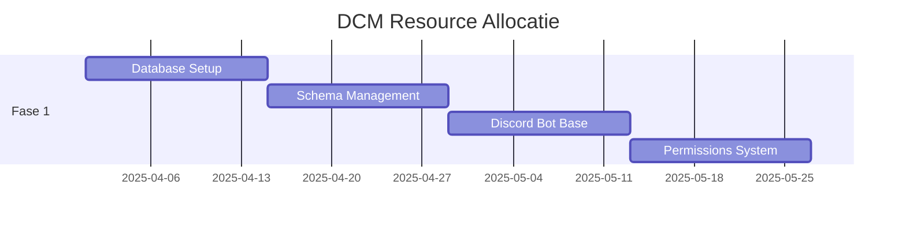
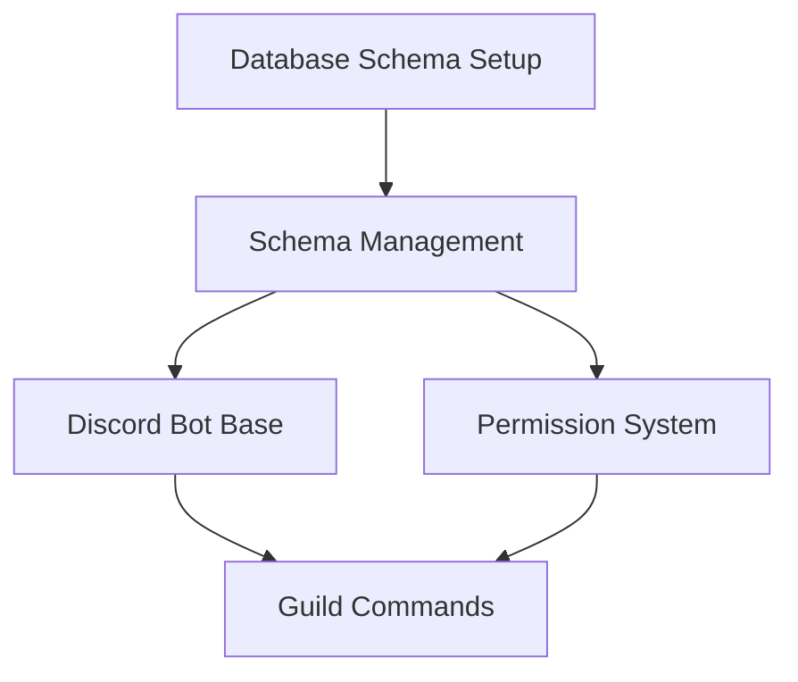

# Discord Cleaning Manager - Project Plan

## 1. Project Overview
- **Project Naam:** Discord Cleaning Manager (DCM)
- **Start Datum:** 1 April 2025
- **Geschatte Duur:** 6 maanden
- **Project Manager:** Roo Project Manager

### 1.1 Project Doelstellingen
- Ontwikkeling van een schaalbare Discord bot voor taakbeheer
- Implementatie van een veilige multi-guild architectuur
- Creatie van een gebruiksvriendelijk webdashboard
- Realisatie van een uitgebreid notificatiesysteem

### 1.2 Projectscope
- Discord bot met basis taakbeheer functionaliteit
- Webdashboard voor uitgebreide configuratie
- REST API + WebSocket backend
- Multi-guild database architectuur
- Permissiesysteem op guild niveau
- Notificatie en reminder systeem

## 2. Projectfases

### 2.1 Fase 1: Core Infrastructure (8 weken)
Focus op het opzetten van de fundamentele architectuur en basis functionaliteit.

#### Deliverables
1. Multi-guild database architectuur
   - Schema-based isolation implementatie
   - Database migratie systeem
   - Schema management service
   
2. Basis Discord bot
   - Bot framework setup
   - Guild-isolatie mechanisme
   - Basis command structuur
   
3. Guild-specifieke permissies
   - Permissie management service
   - Role-based access control
   - Guild-level configuratie systeem

#### Tijdlijn
- Week 1-2: Database architectuur setup
- Week 3-4: Schema management implementatie
- Week 5-6: Discord bot basis implementatie
- Week 7-8: Permissiesysteem ontwikkeling

#### Resources
- 2x Backend Developer
- 1x Database Specialist
- 1x DevOps Engineer

#### Dependencies
- PostgreSQL database setup
- Discord Developer Account
- Bot hosting infrastructuur

#### Risico's & Mitigatie
1. **Database Performance**
   - Risico: Schema switching overhead
   - Mitigatie: Implementeer efficiënt connection pooling
   
2. **Data Isolatie**
   - Risico: Cross-guild data leakage
   - Mitigatie: Uitgebreide security tests en audit
   
3. **Discord Rate Limits**
   - Risico: Bot functionaliteit beperking
   - Mitigatie: Implementeer queue systeem met rate limiting

#### Quality Gates
- Database performance tests
- Security audit completion
- Integration test coverage >90%
- Successful multi-guild isolation tests
- Load testing resultaten binnen norm

### 2.2 Fase 2: Web Interface (6 weken)
Focus op het ontwikkelen van het webdashboard en de ondersteunende API's.

#### Deliverables
1. Frontend Dashboard
   - React applicatie setup
   - Guild selectie interface
   - Taakbeheer views (lijst/kanban/kalender)
   - Responsive design

2. Backend API's
   - REST API endpoints
   - WebSocket integratie
   - Real-time updates
   - API documentatie

3. Guild-specifieke Features
   - Guild-switch mechanisme
   - Per-guild configuratie interface
   - Guild-specifieke statistieken

#### Tijdlijn
- Week 1-2: Frontend foundation & auth flow
- Week 3-4: Kern dashboard functionaliteit
- Week 5-6: Real-time updates & polish

#### Resources
- 2x Frontend Developer
- 1x Backend Developer
- 1x UX Designer
- 1x QA Engineer

#### Dependencies
- Werkende auth service
- Guild permissie systeem
- API gateway infrastructuur

#### Risico's & Mitigatie
1. **Frontend Performance**
   - Risico: Trage UI bij veel guild data
   - Mitigatie: Virtualisatie en lazy loading

2. **Real-time Sync**
   - Risico: Inconsistente data tussen clients
   - Mitigatie: Robust WebSocket error handling

#### Quality Gates
- Lighthouse scores >90
- E2E test coverage
- Cross-browser compatibiliteit
- Accessibility compliance
- Performance benchmarks

### 2.3 Fase 3: Advanced Features (6 weken)
Focus op geavanceerde functionaliteit en gebruikerservaring.

#### Deliverables
1. Notificatie Systeem
   - Multi-channel notifications
   - Custom notification templates
   - Notification preferences
   - Escalation flows

2. Taak Automatisering
   - Recurring tasks
   - Auto-assignment logic
   - Task templates
   - Bulk operations

3. Statistieken & Rapporten
   - Guild activity dashboards
   - Custom report builder
   - Export functionaliteit
   - Performance metrics

#### Tijdlijn
- Week 1-2: Notificatie systeem
- Week 3-4: Taak automatisering
- Week 5-6: Statistieken & rapportages

#### Resources
- 1x Frontend Developer
- 2x Backend Developer
- 1x Data Engineer
- 1x QA Engineer

#### Dependencies
- Basis taakbeheer systeem
- Notificatie infrastructuur
- Statistieken database schema

#### Risico's & Mitigatie
1. **Notification Overload**
   - Risico: Te veel notificaties
   - Mitigatie: Smart batching & throttling

2. **Automatisering Complexiteit**
   - Risico: Moeilijk te debuggen flows
   - Mitigatie: Uitgebreide logging & monitoring

#### Quality Gates
- Notification delivery success rate
- Automation reliability metrics
- Report generation performance
- System resource usage

### 2.4 Fase 4: Optimization & Scale (4 weken)
Focus op optimalisatie, schaalbaarheid en productie-gereedheid.

#### Deliverables
1. Performance Optimalisatie
   - Query optimalisatie
   - Caching strategie
   - Frontend bundle optimalisatie
   - API response times

2. Schaalbaarheid
   - Horizontal scaling setup
   - Load balancing configuratie
   - Database partitioning
   - Cache distribution

3. Monitoring & Observability
   - Logging infrastructure
   - Performance monitoring
   - Error tracking
   - User analytics

#### Tijdlijn
- Week 1: Performance optimalisatie
- Week 2: Schaalbaarheid implementatie
- Week 3: Monitoring setup
- Week 4: Fine-tuning & documentatie

#### Resources
- 1x Performance Engineer
- 1x DevOps Engineer
- 1x Backend Developer
- 1x SRE

#### Dependencies
- Productie-like test omgeving
- Monitoring infrastructuur
- Load testing tools

#### Risico's & Mitigatie
1. **Scaling Bottlenecks**
   - Risico: Onverwachte performance issues
   - Mitigatie: Uitgebreide load testing

2. **Monitoring Complexity**
   - Risico: Te veel metrics/alerts
   - Mitigatie: Focus op key indicators

#### Quality Gates
- Performance benchmark targets
- Scaling test resultaten
- Monitoring coverage
- Documentation completeness

## 3. Resource Allocatie

### 3.1 Team Samenstelling
- Project Manager (1x)
- Backend Developers (2x)
- Frontend Developers (2x)
- Database Specialist (1x)
- DevOps Engineer (1x)
- QA Engineer (1x)

### 3.2 Resource Planning


## 4. Dependencies Map


## 5. Critical Path Analyse
1. Database architectuur implementatie (2 weken)
2. Schema management service (2 weken)
3. Discord bot basis implementatie (2 weken)
4. Permissiesysteem (2 weken)

Totale kritieke pad duur: 8 weken voor Fase 1

## 6. Risk Assessment Matrix

| Risico | Impact | Waarschijnlijkheid | Mitigatie Strategie |
|--------|--------|-------------------|-------------------|
| Database Performance | Hoog | Medium | Connection pooling, query optimalisatie |
| Data Isolatie | Hoog | Laag | Security tests, audit logging |
| Discord Rate Limits | Medium | Hoog | Queue systeem, caching |
| Schema Scaling | Medium | Medium | Horizontale partitionering |

## 7. Sprint Planning Template

### Sprint Overview
- **Duur:** 2 weken
- **Story Points:** 40 punten per sprint
- **Ceremonies:**
  - Sprint Planning: Maandag 10:00
  - Daily Standup: Dagelijks 09:30
  - Sprint Review: Vrijdag 14:00
  - Retrospective: Vrijdag 15:00

### Sprint Backlog Template
```markdown
## Sprint X (YYYY-MM-DD - YYYY-MM-DD)

### Doelen
- [Doel 1]
- [Doel 2]

### User Stories
- [ ] (xx pts) Als gebruiker wil ik...
- [ ] (xx pts) Als admin wil ik...

### Technische Tasks
- [ ] (xx pts) Implementeer...
- [ ] (xx pts) Optimaliseer...

### Quality Gates
- [ ] Code review completed
- [ ] Tests passed
- [ ] Documentation updated
```

## 8. Monitoring & Reporting

### 8.1 Key Performance Indicators (KPIs)
- Sprint velocity
- Bug resolution time
- Test coverage
- System performance metrics
- User satisfaction metrics

### 8.2 Reporting Schedule
- Dagelijkse status updates
- Wekelijkse sprint reports
- Maandelijkse project health reports
- Quarterly stakeholder presentations

## 9. Communication Plan

### 9.1 Interne Communicatie
- Dagelijkse standups via Discord
- Wekelijkse team meetings
- Project documentation in GitHub
- Technical discussions in Discord threads

### 9.2 Stakeholder Communicatie
- Wekelijkse status updates
- Maandelijkse review sessions
- Quarterly progress reports
- Ad-hoc issue escalation process

## 10. Quality Assurance

### 10.1 Quality Gates
- Code review approval
- Test coverage >90%
- Performance benchmarks
- Security audit passing
- Documentation completeness

### 10.2 Testing Strategy
- Unit tests (Jest)
- Integration tests
- End-to-end tests
- Performance tests
- Security tests

---

*Laatste update: 2025-04-01*